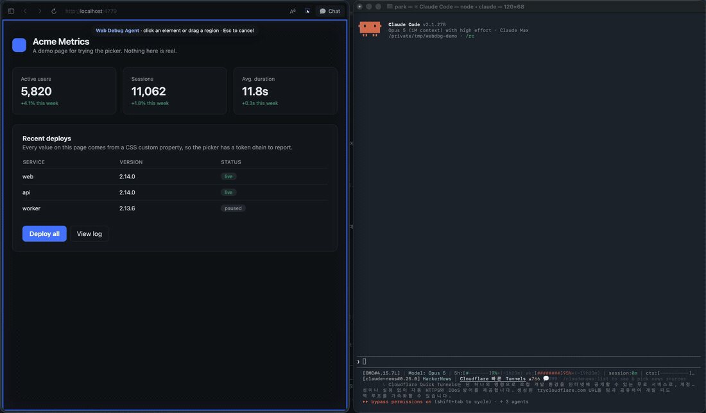
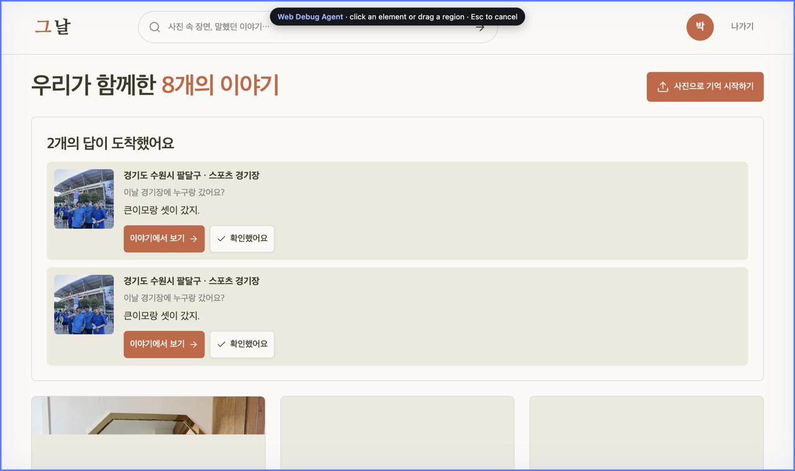
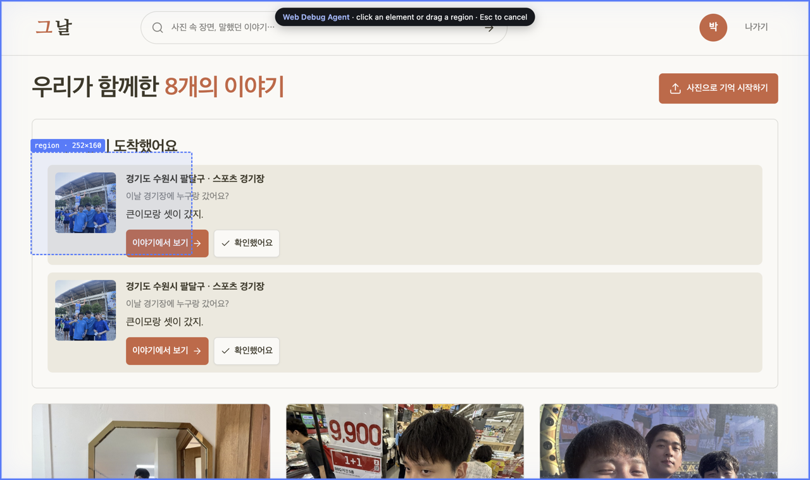
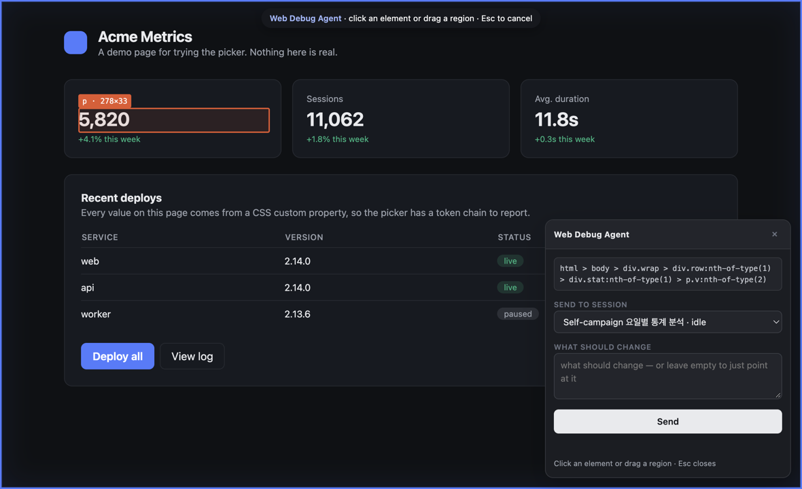

# instant-web-capture-for-agent

Point at part of a page you are building, and hand it to the coding agent
session of your choice — with a screenshot and the source lines attached.



*Left: the page being built. Right: the Claude Code session that was picked,
receiving the request and opening the screenshot that came with it.*

Other click-to-edit tools route by project directory, so whichever agent happens
to watch that folder picks the request up. This one routes by **session**: the
picker lists your live Claude Code sessions and recent Codex threads by their
real titles, and you choose one.

## Install

```sh
npx webdbg              # prints a token; leave it running
```

The extension cannot open a Unix socket or read `~/.claude`, so something on
your machine has to do that for it. That something is this bridge, and it has to
stay running while you use the picker.

Then install the extension and open its options page: paste the token,
**Save and test**, then hit **Enable screenshots**.

That last button asks for `<all_urls>`, because Chrome grants
`captureVisibleTab` under nothing narrower. It is an optional permission, so the
extension installs without it and you decide. It does not widen where the picker
runs: the content script is declared for `localhost`, `127.0.0.1` and
`*.localhost` only. Skip it and selections still send — just without the image.

To run the extension from source instead of the store, use
`chrome://extensions` → Developer mode → **Load unpacked** and point it at
`npx webdbg extension`.

## Try it

```sh
npx webdbg demo         # a throwaway page at http://localhost:4779
```

The screenshots below are that page. Every value in it comes from a CSS custom
property, so you can see the token chain the picker reports.

## Use

Press **Cmd+Shift+U** (Ctrl+Shift+U on Windows/Linux). A blue ring and a chip
tell you the picker is live.



**Click** an element, or **drag** a region:





Pick the session, say what should change, **Send** (or Cmd+Enter). Leave the box
empty to just point at something. **Esc** cancels.

The site you used last is remembered, so a given app keeps going to the same
session.

## What the agent gets

```
region: 596x322
screenshot: ~/.webdbg/shots/1789625849217-e534fd.png

elements (nesting shown; text is each element's own, not its children's):
src/components/Card.tsx:12:5  <div>  948x235
├─ :14:7   <div>  146x24   "파트너 크리에이터 모집"
├─ :18:9   <p>    898x21   "직접 선정하여 브랜드에 적합한 콘텐츠를…"
└─ :22:9   <div>  898x112

declared by:
  border-radius: calc(var(--radius) - 2px)
    ← .rounded-md
    ← --radius: 0.5rem
```

Four things are deliberate:

- **Nesting is shown**, so containment does not have to be guessed from coordinates.
- **Text is each element's own**, not `innerText`, so a parent does not repeat
  everything its children already said.
- **The source line leads**, and the path repeats only when it changes. Requires
  a JSX source stamp — the
  [claude-design-mode](https://github.com/pokefang/design-mode) Vite plugin adds
  one; without it you get selectors instead.
- **Rules come with their `var()` chain.** Given only `border-radius: 6px` an
  agent will write `6px` into your code and quietly kill theming; given the
  chain it swaps a token.

## Requirements

Node 22+, Chrome or any Chromium browser, and Claude Code and/or the Codex CLI
on the same machine.

## How it works

```
extension ──http──▶ bridge :4778 ──unix socket──▶ Claude Code session
                                 └──codex queue──▶ Codex thread
```

**Claude Code.** Every live session writes `~/.claude/sessions/<pid>.json`
naming its own Unix socket, with a paired `<pid>.<sha256(socketPath)>.key`
holding a peer token. Messaging is two NDJSON lines:

```
{"type":"auth","token":"<peerToken>"}
{"msgV":1,"msg_id":"<uuid>","type":"user","message":{"role":"user","content":"…"},"priority":"next","from":"uds:webdbg"}
```

Sessions name themselves `park-ee` and similar, so the picker shows the
`ai-title` from the transcript instead — the same title `/resume` lists.

**Codex.** Supported CLI surface, nothing reverse-engineered:
`~/.codex/session_index.jsonl` names every thread and `codex queue --thread <id>
--message <text>` delivers. A queued message waits for a thread that is not
open, so Codex targets do not have to be live.

## Security

The bridge can type into every agent session on the machine, so:

- **The picker only injects on `localhost`, `127.0.0.1` and `*.localhost`.** This
  is the load-bearing restriction. The payload carries page text, so a hostile
  page would otherwise be able to put instruction-shaped text where a click
  scoops it up.
- **The bridge binds to loopback and requires a bearer token** (`~/.webdbg/token`,
  mode 600). The page never sees the token or any session's socket path — the
  content script talks only to the extension's service worker.
- **Messages are attested and the body is sanitized.** A receiving session holds
  an unattested cross-session message for approval; this attests `from-mode` so
  clicks land without a prompt. That attestation is a self-claim the receiver
  cannot verify, which is exactly why the origin restriction has to stay. Page
  text cannot close the wrapper and open one of its own.

Unset `WEBDBG_ATTEST_MODE` to go back to approving each message by hand.

## Notes

- The session socket protocol is private to Claude Code and undocumented; it was
  read off the wire and can change between releases. `bridge/sessions.mjs` is the
  one file to revisit if it does. The Codex side should be stable.
- Reloading an unpacked extension clears its storage, so the token has to be
  pasted again after each reload.
- Screenshots need Chrome's capture permission and the tab must be the active
  one; the request is sent either way and says why a capture is missing.
- Codex threads are listed from the last 7 days, newest first, capped at 25.
- Short name in the code, paths and env vars: `webdbg`.

## License

MIT
